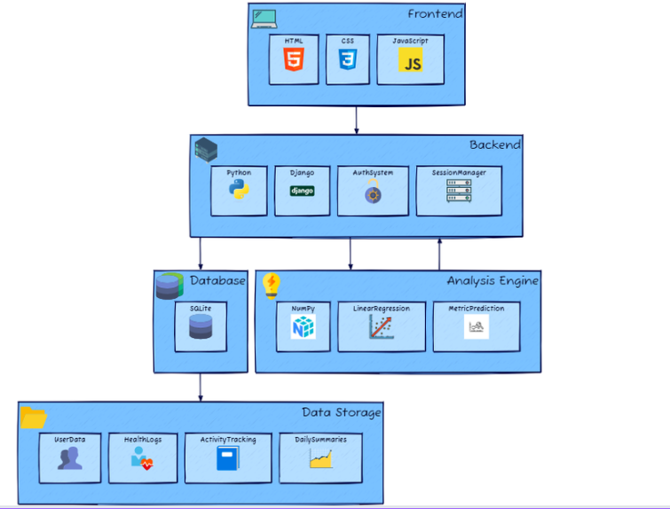
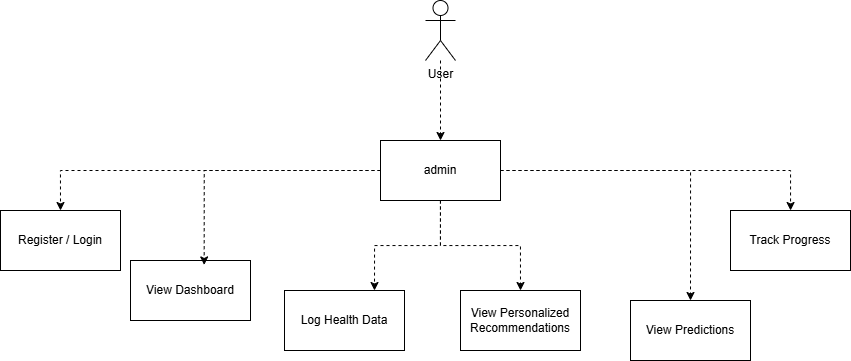
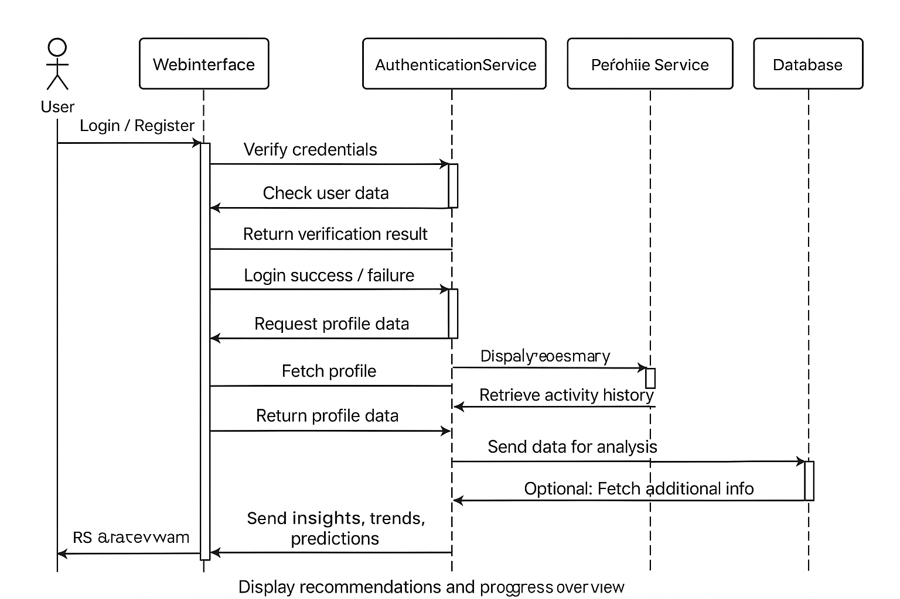
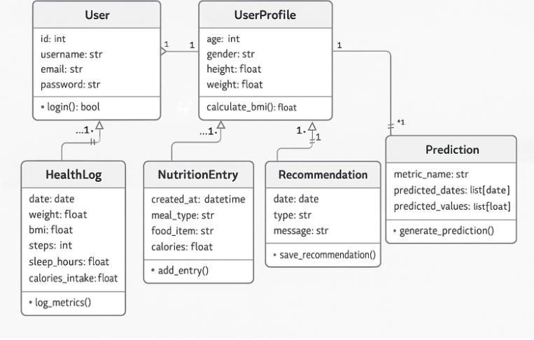
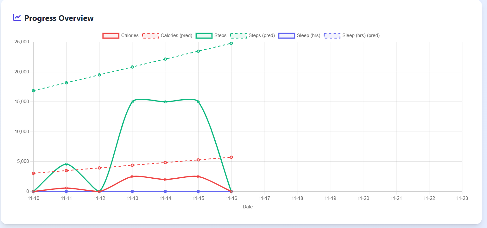
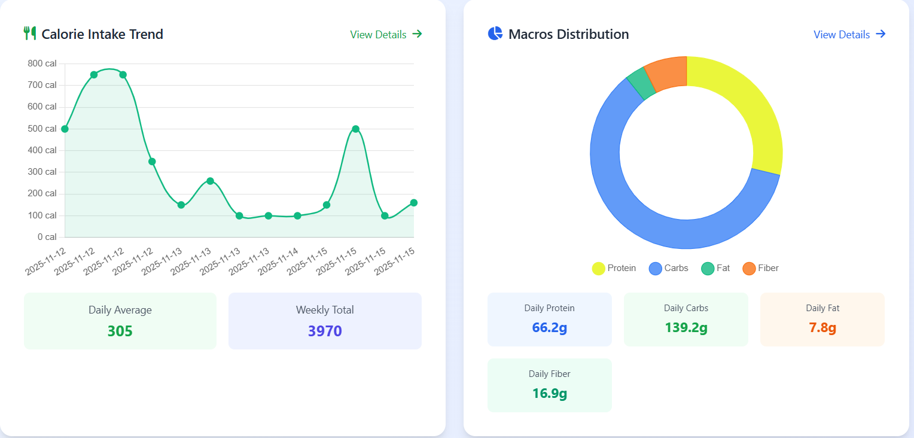
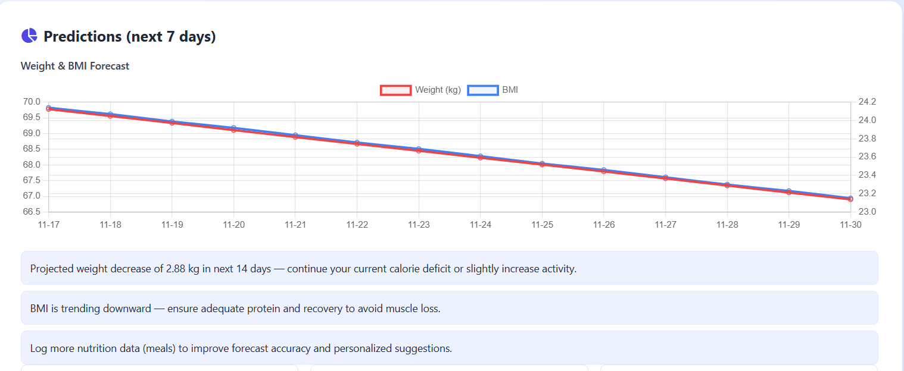
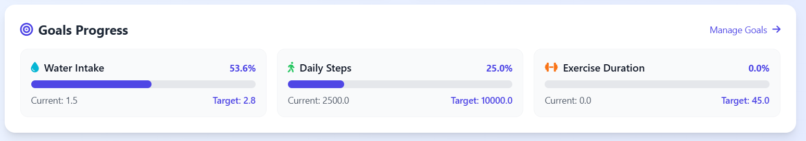
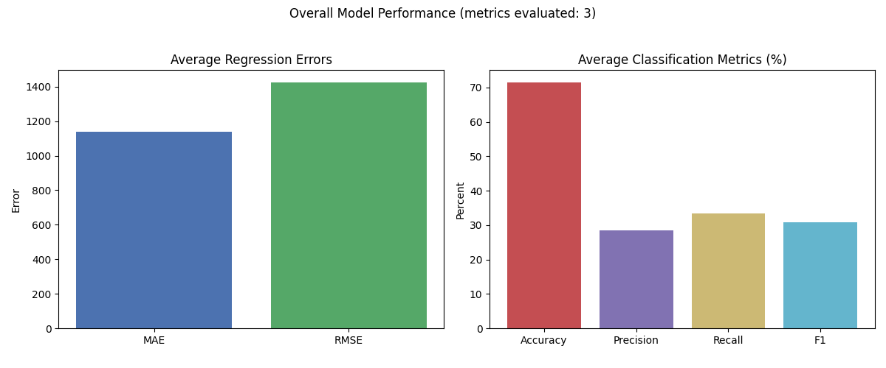

# **LifeTrack – AI-Powered Health & Lifestyle Monitoring Syste**

## **Title of the Project**
**LifeTrack – AI-Enhanced health monitoring system**

---

## **Small Description**
LifeTrack is an AI-powered health monitoring platform designed to track daily activities, analyze habits, and generate personalized predictions to help users maintain a healthier lifestyle.

---

## **About**
**LifeTrack** is an intelligent health and lifestyle management system that automatically tracks a user’s daily steps, calorie intake, sleep duration, and other wellness metrics.

The system utilizes machine learning models to analyze behavioral patterns and generate meaningful insights such as weekly activity forecasts and personalized recommendations.

Traditional self-tracking requires multiple apps and manual data entry, often leading to inconsistent and ineffective monitoring. LifeTrack solves this by providing:
- An integrated dashboard  
- Automated predictions  
- Visual insights  

All combined into one seamless and user-friendly health monitoring platform.

---

## **Features**
- Advanced Machine Learning prediction models  
- Real-time monitoring of health metrics  
- Interactive dashboards with charts and visual insights  
- Personalized recommendations based on user behavior  
- High scalability and optimized data processing  
- Clean modular architecture with Django backend  

---

## **Requirements**

## **Libraries required**
```python

pip install django 
```
```python
pip install django-allauth
```
```python
pip install PyJWT
```
```python
pip install jwt 

```
### **Operating System**
- Windows / Ubuntu (64-bit recommended)

### **Programming Language**
- Python 3.8 or later

### **Backend Framework**
- Django

### **Machine Learning Libraries**
- scikit-learn  
- pandas  
- numpy  

### **Visualization Libraries**
- matplotlib  

### **Development Tools**
- VS Code  
- Git for version control  

### **Other Dependencies**
- Django REST Framework (if API integration is required)

---

## **System Architecture**
### **System Architecture Diagram**



---

---
## **UML Diagrams**

---


---

---



---

---



---

---

## **Output**


### **Output 1 – Progress overview**

Displays daily activity overview, including steps, calories, and sleep patterns.

### **Output 2 - Calorie intake & macros**


Displays the calorie intake and macros distribution.


### **Output 3 – Prediction & Recommendations**

Shows AI-based predictions for the next 7 days along with personalized suggestions.


### **Output 4 - Goals & achieved targets**

Shows the goals and achieved targets to keep and stay focused


### **Output 5 - Personalized recommendations**

Shows and fetch the values from the macros and calories and suggest the recommendations based on the values


---

## **Prediction Accuracy**



---

## **Results and Impact**
LifeTrack enhances overall health awareness by providing users with meaningful insights about their daily habits and long-term behavior patterns.

With visual trend analysis and weekly predictions, users can make informed lifestyle adjustments.  
The system supports goal tracking, encourages healthier routines, and simplifies wellness monitoring—integrating technology seamlessly into daily health management.

This project demonstrates the growing potential of AI in personal healthcare and future smart-wellness applications.

---

## **References**
A Review of the Role of Artificial Intelligence in Healthcare
     Ahmed Al Kuwaiti 1,*, Khalid Nazer 2,3, Abdullah Al-Reedy 4, Shaher Al-Shehri 5, Afnan Al-Muhanna 6,7, Arun Vijay Subbarayalu 8, Dhoha Al Muhanna 9, Fahad A Al-Muhanna 10,11


Artificial Intelligence and Machine Learning Technologies for Personalized Nutrition: A Review
     by Dimitris Tsolakidis,Lazaros P. Gymnopoulos and Kosmas Dimitropoulos

---
